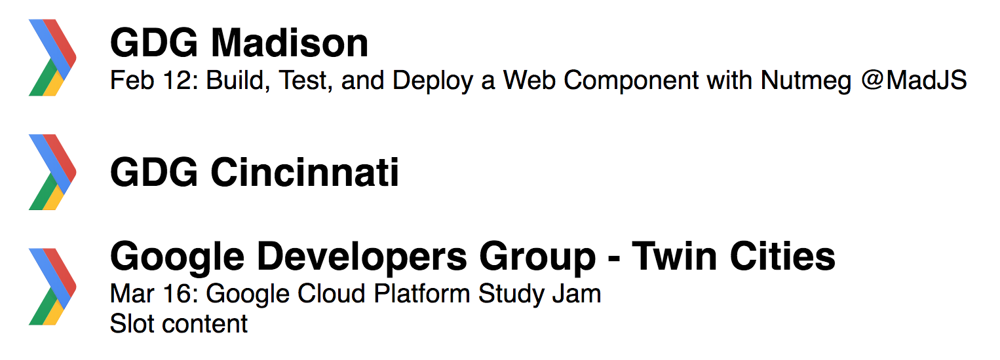

&lt;gdg-group&gt;
====



Install
----

Polyfill tags if you need them. This will include ShadowDOM and Custom Elements support.

```
<script src="https://unpkg.com/@webcomponents/webcomponentsjs@latest/webcomponents-sd-ce.js"></script>
```

Loading this component. It would be a good idea to use a specific version instead of `latest`.

```
<script src="https://unpkg.com/gdg-group@latest/dist/gdg-group.min.js"></script>
```


Usage
----

Properties: 

**urlname**: string
  - required
  - the name that appears in the Meetup url

**showNextEvent**: boolean
  - optional
  - include this property if you would like the display the next scheduled event

```
  <gdg-group urlname="gdg-madison" showNextEvent></gdg-group>

  <gdg-group urlname="cincy-android"></gdg-group>

  <gdg-group urlname="gdg-tc">Slot content</gdg-group>

```

License
----

GdgGroup is released under an MIT license.

Built, tested, and published with [Nutmeg](https://nutmeg.tools).
